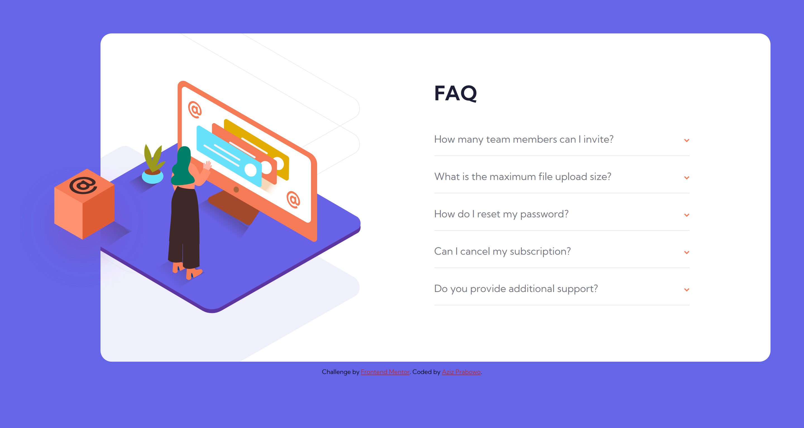

# Frontend Mentor - FAQ accordion card solution

This is a solution to the [FAQ accordion card challenge on Frontend Mentor](https://www.frontendmentor.io/challenges/faq-accordion-card-XlyjD0Oam). Frontend Mentor challenges help you improve your coding skills by building realistic projects.

## Table of contents

- [Overview](#overview)
  - [The challenge](#the-challenge)
  - [Screenshot](#screenshot)
  - [Links](#links)
- [My process](#my-process)
  - [Built with](#built-with)
  - [What I learned](#what-i-learned)
- [Author](#author)

## Overview

### The challenge

Users should be able to:

- View the optimal layout for the component depending on their device's screen size
- See hover states for all interactive elements on the page
- Hide/Show the answer to a question when the question is clicked


### Screenshot



### Links

- Solution URL: [SOLUTION](https://www.frontendmentor.io/solutions/faq-accordion-card-using-css-flexbox-and-vanilla-js-WodkZk38Mm)
- Live Site URL: [LIVE SITE](https://azizp128.github.io/Faq-Accordion-Card/)

## My process

### Built with

- Semantic HTML5 markup
- CSS custom properties
- Flexbox
- Mobile-first workflow

### What I learned

I learned a lot of things in this challenge, especially about the floating elements. There are new things like using HTML picture element and srcset to use many images in different situations.

To see how you can add code snippets, see below:

```html
<picture>
  <source srcset="images/illustration-woman-online-desktop.svg" media="(min-width: 1150px)" />
  
</picture>
```

```css
.card__header {
  max-width: 1000px;
  background-image: url(images/bg-pattern-desktop.svg);
  background-repeat: no-repeat;
  background-size: 150%;
  background-position: -23em -10em;
  padding-top: 7em;
  padding-bottom: 12em;
  margin-left: -8em;
  margin-top: -7em;
  margin-right: 5em;
  margin-bottom: -5em;
  align-self: baseline;
  overflow: visible;
}
```

## Author

- Frontend Mentor - [@azizp128](https://www.frontendmentor.io/profile/azizp128)
- Twitter - [@azizprbw](https://www.twitter.com/azizprbw)
